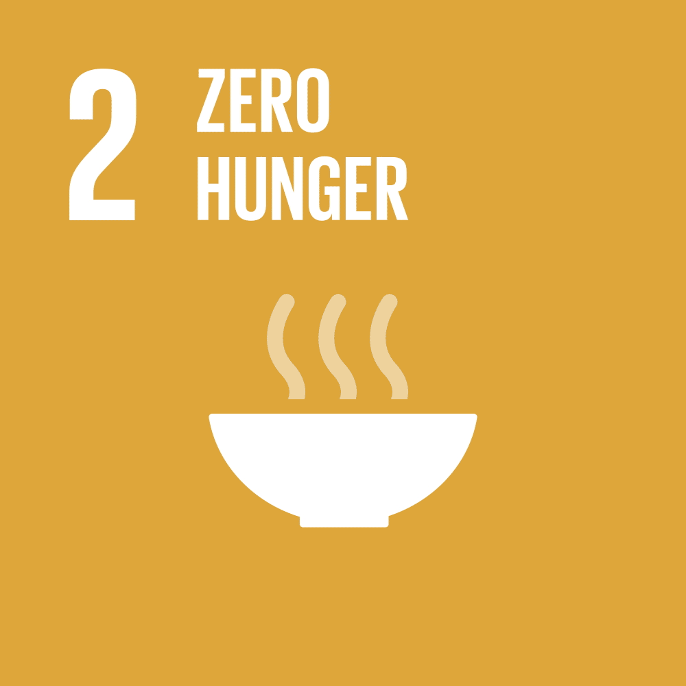

# What to Produce in Turkey
 Samsung Innovation Campus Project
 
 
 
 
 

# A. Project Title
[WIP] What to produce in Turkey?

# B. Overview

Our working group is focusing on food safety, specifically improving agricultural efficiency by developing & deploying an ML model that suggests which crop

# C. Background

Since the pandemic

# D. Key Objectives / Research Questions

# E. Work Arrangement

# F. Approach To Work

# G. Tentative Agenda

# H. Deliverables

